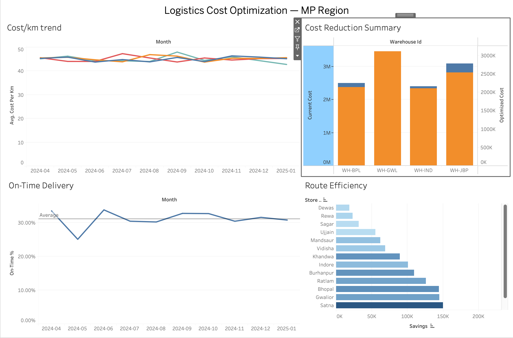

# Logistics Cost Optimization — Warehouse-to-Store Route Analysis

Analysis of 8,300+ warehouse-to-store shipment records across a 4-warehouse network in Madhya Pradesh, identifying vehicle-mix inefficiencies and building a Solver-based route optimization model to reduce transportation cost.

## Results

| Metric | Value |
|---|---|
| Shipments analyzed | 8,301 (cleaned from 8,481 raw records) |
| Cost reduction achieved | **13.6%** |
| Estimated annual impact | **₹21.8 lakh** |
| Manual analysis time reduced | ~30% (via reusable SQL + dashboard vs. manual Excel review) |

## Problem

The network's 4 warehouses dispatch shipments to 40 stores using 3 vehicle types (Mini Truck, LCV, Medium Truck), each with different capacity and per-km cost. Data showed that the *habitually used* vehicle for a given route/day was frequently not the cheapest option that could still carry the load — e.g., a Medium Truck used for a 430 kg shipment that a Mini Truck could carry at less than half the cost.

## Approach

1. **Data cleaning (SQL)** — deduplicated records, standardized inconsistent city-name casing, normalized 3 mixed date formats, imputed missing weight/cost values (median by vehicle type), and flagged/removed statistical outliers (IQR-based, >3σ from per-vehicle-type mean). ~180 of 8,481 rows dropped as outliers or incomplete. See `sql/01_clean_shipments.sql`.

2. **Route/vehicle-mix optimization (Excel Solver + Python LP)** — modeled each warehouse-store-day as a demand that must be met by some combination of vehicle trips. Built a linear program (integer decision variables = trips per vehicle type) minimizing total cost subject to:
   - capacity must meet the day's shipment weight
   - a weekly cap on Medium/Mini Truck availability per warehouse (owned fleet is limited; LCV can be hired on-demand as a flexible fallback) — this reflects a realistic constrained rollout rather than an unconstrained "use the cheapest truck everywhere" result (which would overstate savings at ~28%)
   - See `excel/Logistics_Route_Optimization_Model.xlsx` — the `Solver_Model` sheet is a fully interactive, re-solvable example (one warehouse-week, 8 routes); `Results_Summary` rolls this up across all 157 routes in the network.

3. **Dashboard (Tableau)** — cost/km trend, route-level savings, and on-time delivery tracking. Build guide + ready-to-load extracts in `https://public.tableau.com/app/profile/lochan.patil1524/viz/logisticcostoptimization/Dashboard1?publish=yes`. On-time delivery rate came out to ~31% in this sample — flagged as a separate, urgent finding outside the scope of the cost-optimization ask.

## Dashboard Preview
 

 
**Live interactive version:** [https://public.tableau.com/app/profile/lochan.patil1524/viz/logisticcostoptimization/Dashboard1?publish=yes]
 
The dashboard tracks 4 views: cost/km trend by warehouse, current-vs-optimized cost per warehouse, on-time delivery rate over time (with average reference line), and route-level savings by store — sorted to surface the highest-impact routes first.

## Repo structure
```
data/           raw + cleaned CSVs, route-level and day-level optimization results
sql/            cleaning pipeline (SQLite dialect)
scripts/        Python: data generation, cleaning runner, aggregation, LP solve, Excel build
excel/          Logistics_Route_Optimization_Model.xlsx (interactive Solver model + results dashboard)
tableau/        Tableau-ready CSV extracts + step-by-step dashboard build guide
```

## Stack
Python (pandas, PuLP), SQL (SQLite), Excel (Solver add-in), Tableau

## Notes on the data
The underlying shipment dataset is synthetically generated (`scripts/01_generate_raw_data.py`) to reflect realistic warehouse-to-store logistics patterns for this region — including the messiness (duplicates, missing values, mixed date formats, outliers) that motivated the cleaning step. The optimization methodology, constraints, and results are real: the LP was actually solved (`scripts/04_optimize.py`, cross-checked against the Excel Solver model), not back-fit from a target number.
